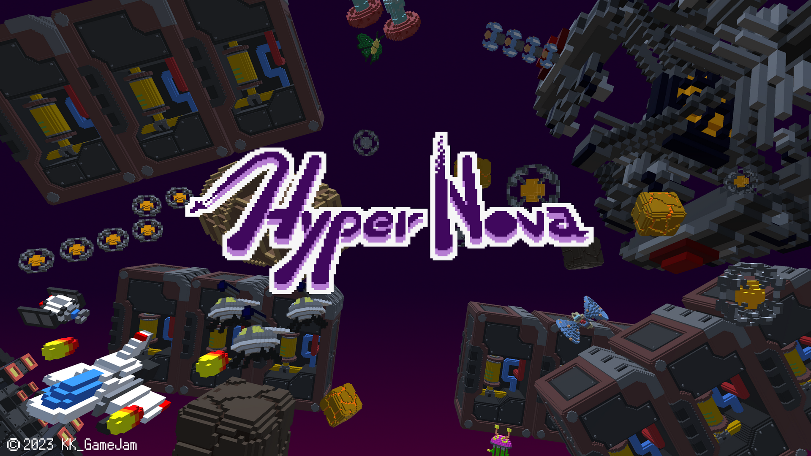
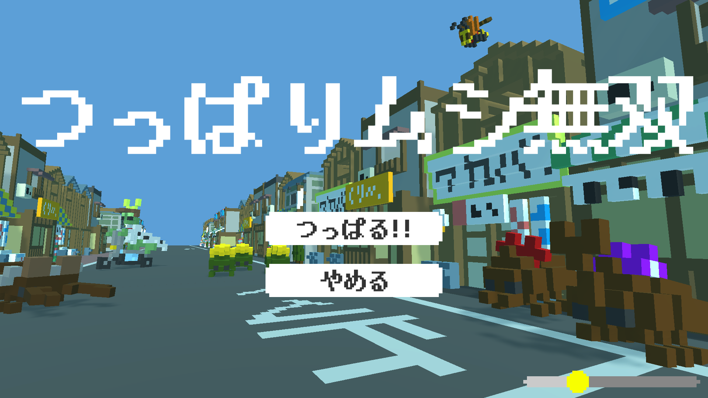
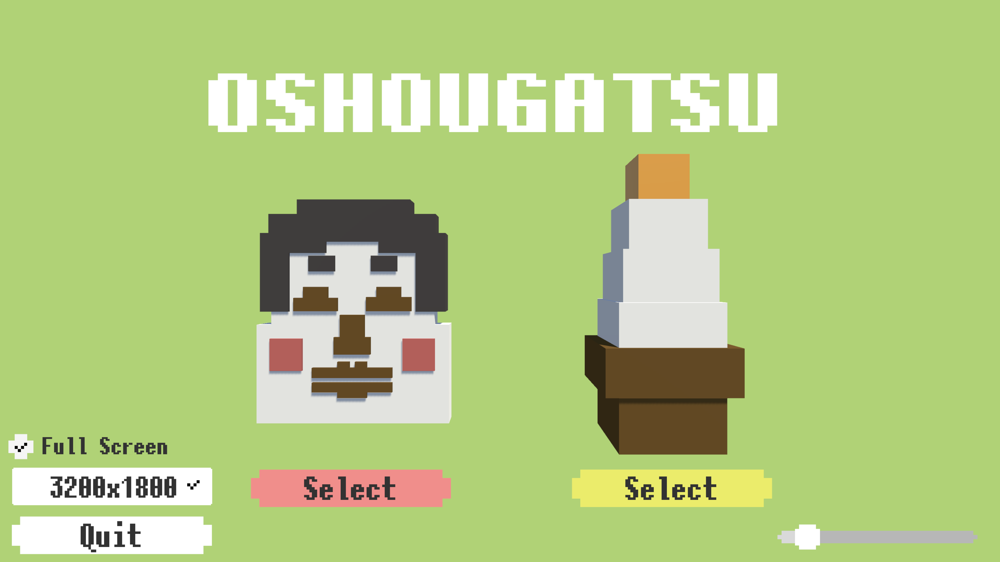
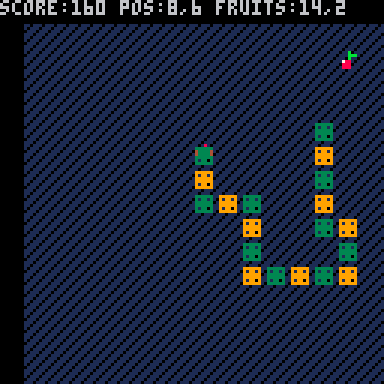

# My Works
 

Please check [Kuritaro Lab](https://kuritaro1122.github.io/)!!

or [twitter](https://twitter.com/S_KuriKun)

# Repository

## Unity
* [ObjectOrderController](https://github.com/kuritaro1122/ObjectOrderController): オブジェクトに命令を付与
* [KuriKit-SimpleGameKit](https://github.com/kuritaro1122/KuriKit-SimpleGameKit): ゲームのステート管理
* [SaveDataManagerForUnity](https://github.com/komihori/SaveDataManagerForUnity): 暗号化されたローカルセーブデータ
* [SoundManager](https://github.com/komihori/SoundManager): AudioLisnerを簡単に実装
* [ModelPivotCompensator](https://github.com/kuritaro1122/ModelPivotCompensator): モデルのピボットを合わせる
* [UISliderStepAdjuster](https://github.com/kuritaro1122/UISliderStepAdjuster): Sliderの変更幅を調整する
* [LineUpGameObject](https://github.com/kuritaro1122/LineUpGameObject): オブジェクトを複製して並べる
* [EntityStatus](https://github.com/kuritaro1122/EntityStatus): HPや攻撃力を管理, 接触時自動攻撃
* [ClampCamera2D](https://github.com/kuritaro1122/ClampCamera2D): グローバル座標をカメラ内座標で管理する
## Python
* [OthelloArenaPython](https://github.com/kuritaro1122/OthelloArenaPython):
* [OthelloArenaPython-PyxelGUI](https://github.com/kuritaro1122/OthelloArenaPython-PyxelGUI):
* [PictureEdit](https://github.com/kuritaro1122/PictureEdit): 画像加工
---

<!--
**kuritaro1122/kuritaro1122** is a ✨ _special_ ✨ repository because its `README.md` (this file) appears on your GitHub profile.

Here are some ideas to get you started:

- 🔭 I’m currently working on ...
- 🌱 I’m currently learning ...
- 👯 I’m looking to collaborate on ...
- 🤔 I’m looking for help with ...
- 💬 Ask me about ...
- 📫 How to reach me: ...
- 😄 Pronouns: ...
- ⚡ Fun fact: ...
-->
